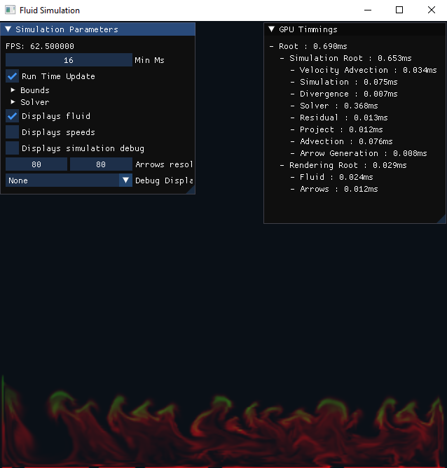
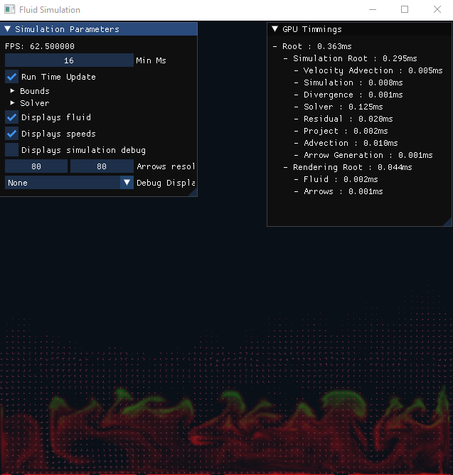
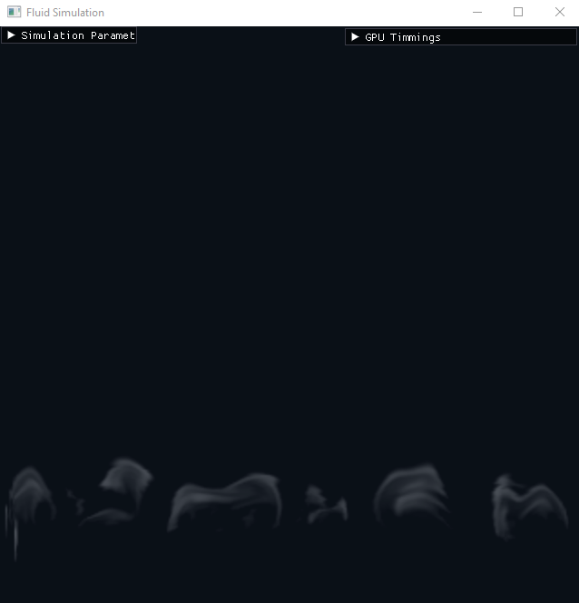

# Fluid Simulation
This project aims to reproduce a published paper on cloud simulations : [Stormscapes : Simulating Cloud Dynamics in the now](http://computationalsciences.org/publications/haedrich-2020-stormscapes.html)

Current state of the project:
- The simulation is only 2D for now
- A basic GPU solver for fluid simulation based on d3d12 compute shaders
- A staggered grid to store velocity (this is a pain in the *** to manage)
- Two types of solver:
  - Basic Jacobi iterations: Very fast. Preconditioned with result from previous frame allowing for convergence in very few iterations
  - Naive multigrid VCycles implementation: Much slower, the goal is to converge faster than classic jacobi, but in reality it is slower than the preconditioned Jacobi.
- Beginning of cloud physics implementation (Not working properly).

The project uses the Mesum framework for the basic application architecture.

## Results
Each simulation cell represents a volume of air of 30m/30m. The grid is 320*320 representing a slice of ~10Km in length and 10km in height.

Red indicates water vapor, green shows condensed water.

It is possible to display some debug information, such as fluid velocity (represented with arrows).

Here we have a display of only the cloudy parts
